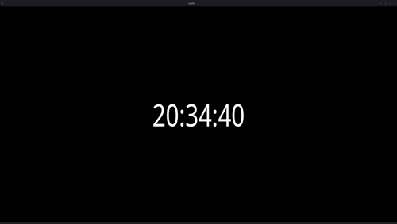

# Needle
Local application that displays the time! \
Uses [wgpu](https://wgpu.rs/) for rendering, [glyphon](https://github.com/grovesNL/glyphon) for text rendering, and written in Rust!

## Installation
Go to [releases](https://github.com/bonohub13/needle/releases/) and download the executable.
- Windows: [needle.exe](https://github.com/bonohub13/needle/releases/download/0.1.1/needle.exe)
- Linux: [needle](https://github.com/bonohub13/needle/releases/download/0.1.1/needle)

## Getting Help
This is a project that is done on my spare time. So please bear that in mind. \
If you have a feature request, please feel welcome to create an issue for feature request. \
Any requested feature that aligns with the [direction of Needle](#direction_of_needle) will be added to the [todo list](#todo_list).

## Direction of Needle 
Needle was originally developed for a friend of mine that does streaming on his spare time. \
He was trying to get a clock to be up on his stream, but the service he was using had the following problems.
- Crashed a LOT.
- Due to it being a web service, it was littered with ads to the point of being unusable.

To address these problems I developed Needle, so he could have a relient app that would be free from ads.

## TODO List 
Following features are to be added in the future. \
Features in the TODO List that have been implemented will be erased from the list after release.

| Date (Added) | Feature                                  | Status        |
|:-------------|:-----------------------------------------|:-------------:|
| 2024/11/17   | Configuration handler                    | High Priority |
| 2024/11/17   | Optional FPS limit                       | In Query      |
| 2024/11/17   | Optional FPS visualization               | In Query      |
| 2024/11/17   | Optional time format                     | In Query      |
| 2024/11/17   | Optional text color                      | In Query      |
| 2024/11/17   | Effects on text via shader code (SPIR-V) | In Query      |
