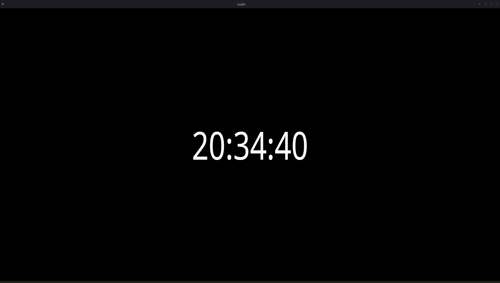

# Needle
Local application that displays the time! \
Uses [wgpu](https://wgpu.rs/) for rendering, [glyphon](https://github.com/grovesNL/glyphon) for text rendering, and written in Rust!

## Installation
Go to [releases](https://github.com/bonohub13/needle/releases/latest) and download the executable.
- Windows: [needle.exe](https://github.com/bonohub13/needle/releases/download/0.1.4-hotfix/needle.exe)
- Linux: [needle](https://github.com/bonohub13/needle/releases/download/0.1.4-hotfix/needle)

## Instruction
- Read the [instructions](./doc/INSTRUCTIONS.md) for examples to use in OBS Studio.
- For Japanese users: [instructions_jp](./doc/INSTRUCTIONS_JP.md)

## Getting Help
This is a project that is done on my spare time. So please bear that in mind. \
If you have a feature request, please feel welcome to create an issue for feature request. \
Any requested feature that aligns with the [direction of Needle](#direction_of_needle) will be added to the [todo list](#todo_list).

## Direction of Needle 
Needle was originally developed for a friend of mine that does streaming on his spare time. \
He was trying to get a clock to be up on his stream, but the service he was using had the following problems.
- Crashed a LOT.
- Due to it being a web service, it was littered with ads to the point of being unusable.

To address these problems I developed Needle, so he could have a relient app that would be free from ads. \
The direction of needle consists of these criteria.
1. K.I.S.S (Keep It Simple Stupid)
2. Usability is the utmost priority.
    - Making needle a feature rich clock is great, but cluttering the app with features \
    to the point where the user feels overwelmed is not.
    - No minor features that fills a niche. (If you want it, fork it)
3. Freedom to do whatever you want.
    - Give the users the capability to do whatever they want.

## TODO List 
Following features are to be added in the future. \
Features in the TODO List that have been implemented will be erased from the list after release.

- Status for individual features
    | Status                      |                                                    |
    |:----------------------------|:---------------------------------------------------|
    | In Query                    | In queue for development                           |
    | High Priority               | High priority in queue                             |
    | In Development              | Currently in development                           |
    | Next Release                | Feature implemented, and in queue for next release |
    | Implemented in VersionX.Y.Z | Feature released on Version X.Y.Z                  |

- Features in queue for development/in active development
    | Date (Added) | Feature                                    | Status                                |
    |:-------------|:-------------------------------------------|:-------------------------------------:|
    | 2024/11/17   | Optional FPS limit                         | Feature released on Version 0.1.4     |
    | 2024/12/22   | Background color via shader code (SPIR-V)  | Feature released on Version 0.1.4     |
    | 2024/12/22   | Update winit version to v0.30              | Feature released on Version 0.1.4     |
    | 2024/12/22   | Documentation for use in OBS Studio        | Feature released on Version 0.1.4     |
    | 2024/12/22   | Auto download default shaders              | Feature released on Version 0.1.4     |
    | 2025/01/01   | Custom font selection                      | Feature released on Version 0.1.4     |
    | 2024/12/22   | Transparent background for Windows         | In Development                        |
    | 2025/02/10   | GUI for app configuration and etc.         | In Development                        |
    | 2025/02/10   | Websocket server/client                    | In Query                              |
