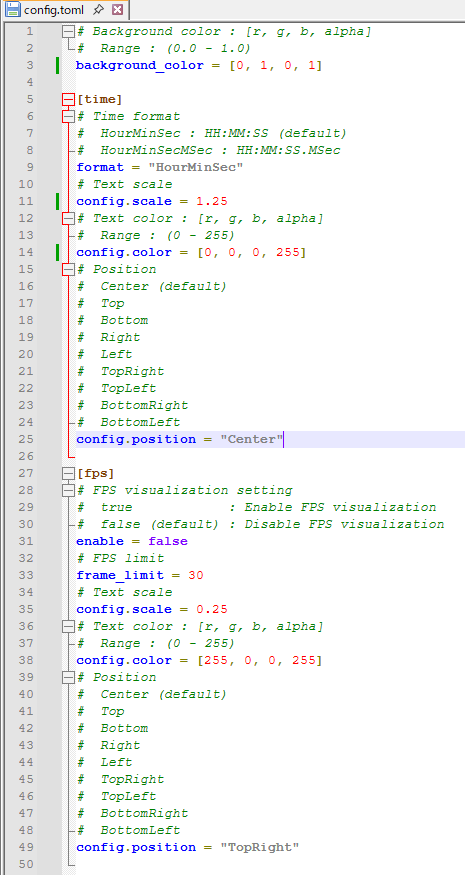
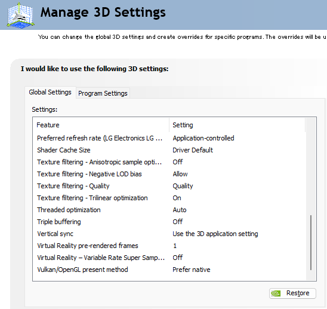

# Instructions
1. [OBS Studio + needle](#needle+OBS_Studio)
2. [Background Transparency on Windows (for users with Nvidia GPU)](#BackgroundTransparency)

## 1. How to use needle in OBS Studio
### 1.0. Preparation (Optional)
- Linux: \
Go to `${HOME}/config/needle` and edit `config.toml` to edit the settings below.
    - Background color (`backgroun_color`)
    - Text format (`format`)
    - Font size (`config.scale`)
    - Font color (`config.color`)
    - Position of text (`config.position`)
    - Frame rate visualization (`fps.enable`)
    - Frame rate limit (`fps_limit`; default: 30)
- Windows: \
Go to `%APPDATA%\bonohub13\needle\config` and edit `config.toml` to edit the settings below.
    - Background color (`backgroun_color`)
    - Text format (`format`)
    - Font size (`config.scale`)
    - Font color (`config.color`)
    - Position of text (`config.position`)
    - Frame rate visualization (`fps.enable`)
    - Frame rate limit (`fps_limit`; default: 30)

### 1.1. Example for usage in OBS Studio
1. Launch needle and OBS Studio.
2. Select `Window Capture` in `Sources`.
    - 
3. Select needle for window source and set the `Capture Method` to `Windows 10 (1903 and up)`
    - 
4. After selecting `needle` in `Sources`, select `filter`.
    - 
5. Add `Color Key` to `Effect Filters` and set the background color to `Key Color Type`.
    - 
6. DONE!
    - 

## 2. Background Transparency on Windows (for users with Nvidia GPU)
### 2.0. Prerequisites
1. Set the transparency (alpha) of background color below 1.0.
2. Install Nvidia GPU driver.

## 2.1. Nvidia driver settings
1. Open `NVIDIA Control Panel`
    - 
2. Go to `Manage 3D Resources`
    - 
3. Set the `Vulken/OpenGl present method` to `Prefer native`
    - 
