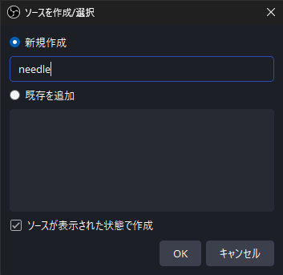
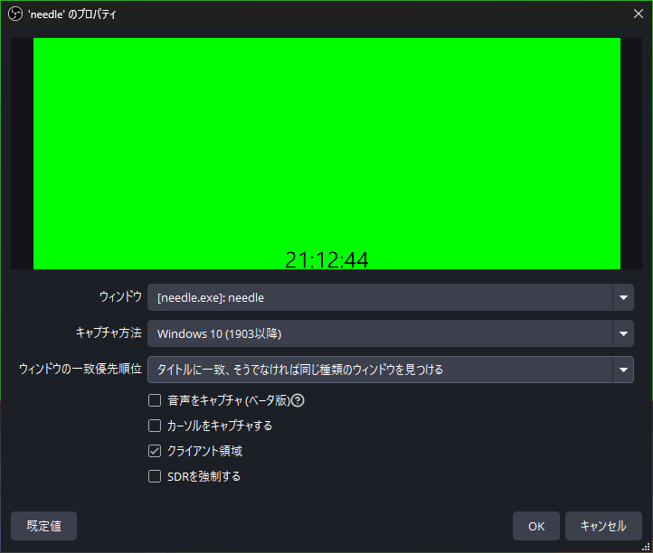
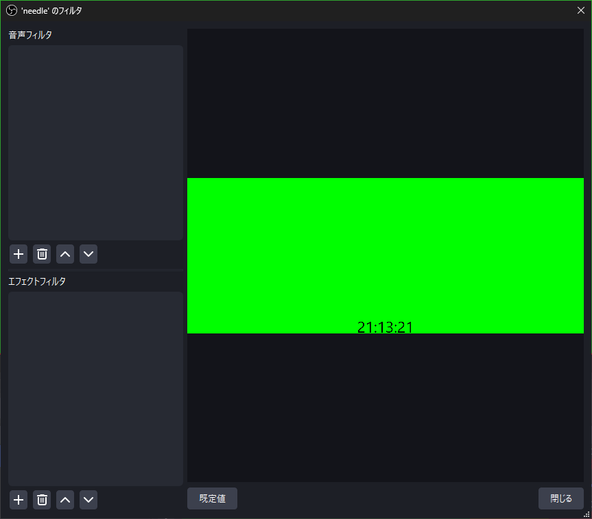
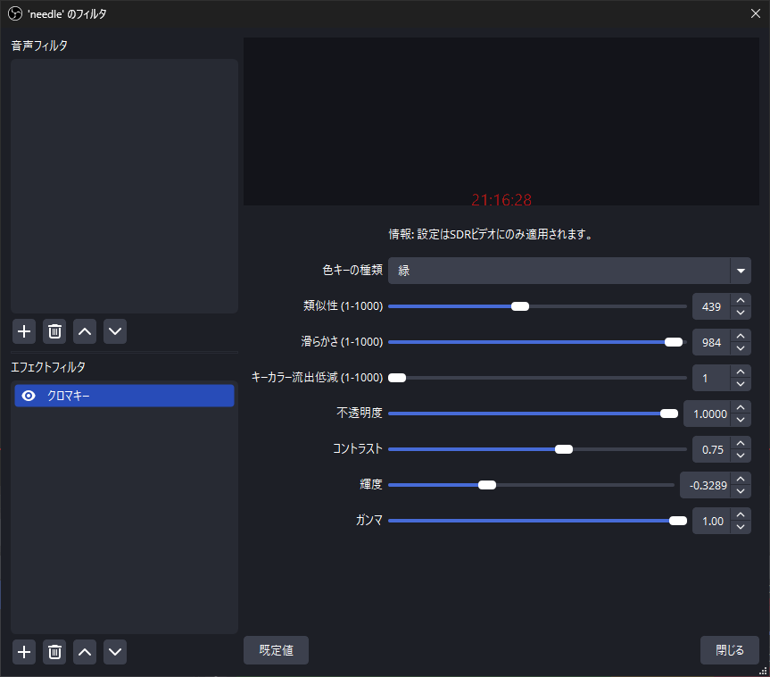
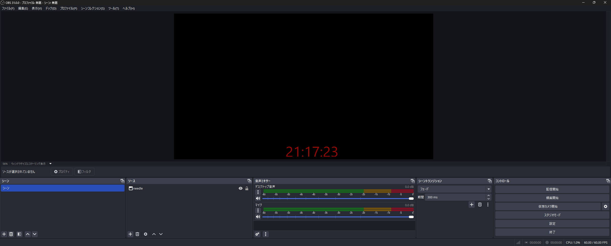

# OBS Studio内でneedleの使用方法
## 0. 準備 (任意)
- Linux: \
`${HOME}/config/needle`ディレクトリ内の`config.toml`で下記の内容が編集可能
    - 背景色 (`backgroun_color`)
    - 時刻のフォーマット (`format`)
    - テキストのサイズ (`config.scale`)
    - テキストの色 (`config.color`)
    - テキストの配置 (`config.position`)
    - フレームレートの表示 (`fps.enable`)
    - フレームレートの上限値設定 (`fps_limit`; デフォルト: 30)
- Linux: \
`%APPDATA%\bonohub13\needle\config`ディレクトリ内の`config.toml`で下記の内容が編集可能
    - 背景色 (`backgroun_color`)
    - 時刻のフォーマット (`format`)
    - テキストのサイズ (`config.scale`)
    - テキストの色 (`config.color`)
    - テキストの配置 (`config.position`)
    - フレームレートの表示 (`fps.enable`)
    - フレームレートの上限値設定 (`fps_limit`; デフォルト: 30)

## 1. OBS Studio内の使用例
1. OBS Studioとneedleを起動します。
2. `ソースを作成/選択` 下の `ウィンドウキャプチャ`を押します。
    - 
3. needleをソースとして選択後、 `キャプチャ方法` を `Windows 10 (1903以降)`に指定します。
    - 
4. ソース内の`needle` を選択後、`フィルタ`ボタンを押します。
    - 
5. `エフェクトフィルタ`内の`クロマキー`フィルタを押します。
    - 
6. 背景色を`色キーの種類`に指定して、`閉じる`を押してた後に背景色が透明化されていることを確認できます。
    - 
