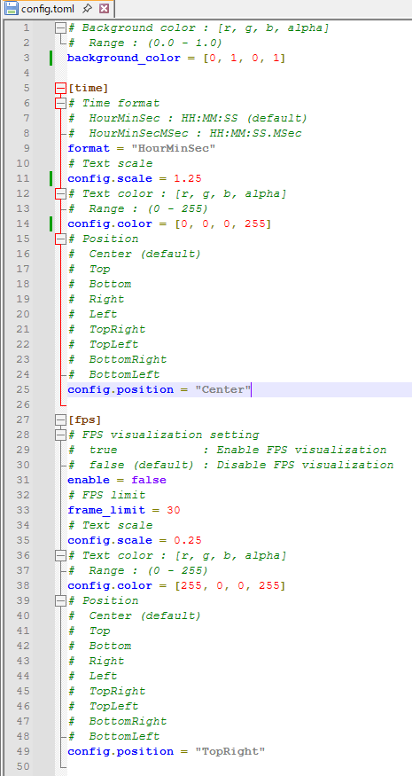

# OBS Studio内でneedleの使用方法
## 0. 準備 (任意)
- Linux: \
`${HOME}/config/needle`ディレクトリ内の`config.toml`で下記の内容が編集可能
    - 背景色 (`backgroun_color`)
    - 時刻のフォーマット (`format`)
    - テキストのサイズ (`config.scale`)
    - テキストの色 (`config.color`)
    - テキストの配置 (`config.position`)
    - フレームレートの表示 (`fps.enable`)
    - フレームレートの上限値設定 (`fps_limit`; デフォルト: 30)
- Linux: \
`%APPDATA%\bonohub13\needle\config`ディレクトリ内の`config.toml`で下記の内容が編集可能
    - 背景色 (`backgroun_color`)
    - 時刻のフォーマット (`format`)
    - テキストのサイズ (`config.scale`)
    - テキストの色 (`config.color`)
    - テキストの配置 (`config.position`)
    - フレームレートの表示 (`fps.enable`)
    - フレームレートの上限値設定 (`fps_limit`; デフォルト: 30)

## 1. OBS Studio内の使用例
1. OBS Studioとneedleを起動.
2. Select `Window Capture` in `Sources`.
    - 
3. Select needle for window source and set the `Capture Method` to `Windows 10 (1903 and up)`
    - 
4. After selecting `needle` in `Sources`, select `filter`.
    - 
5. Add `Color Key` to `Effect Filters` and set the background color to `Key Color Type`.
    - 
6. DONE!
    - 
